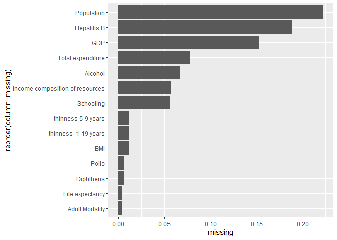
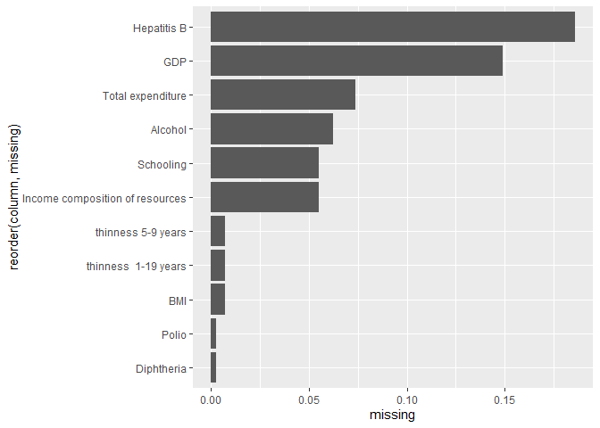
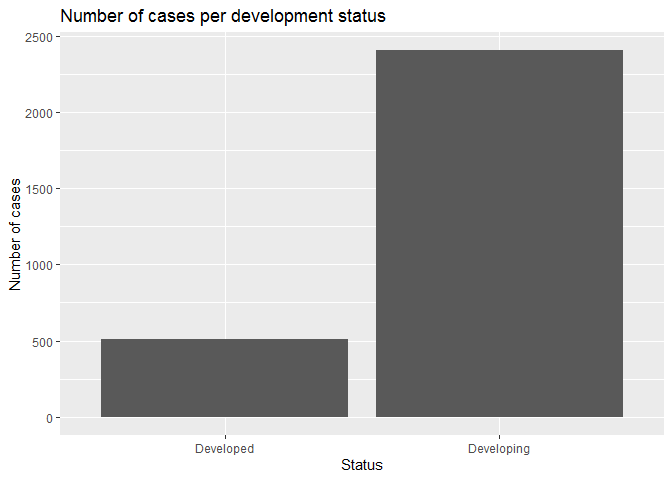
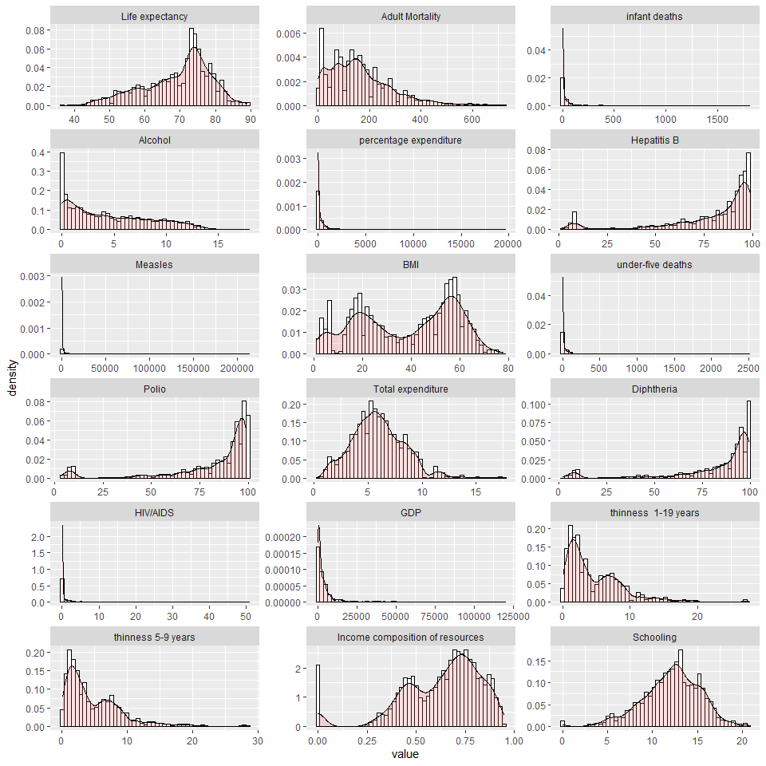
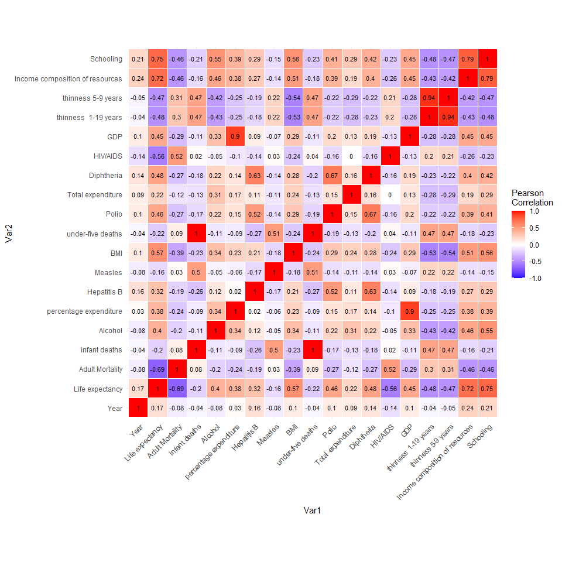
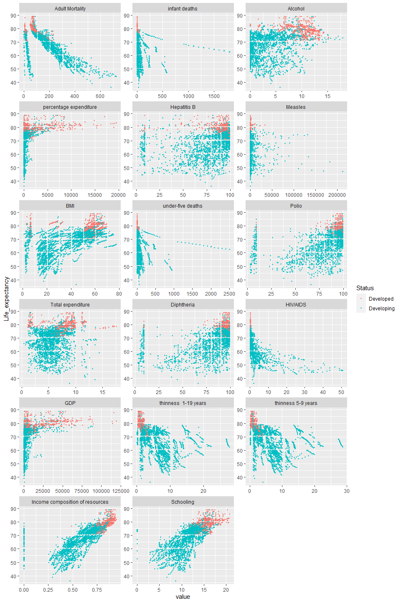
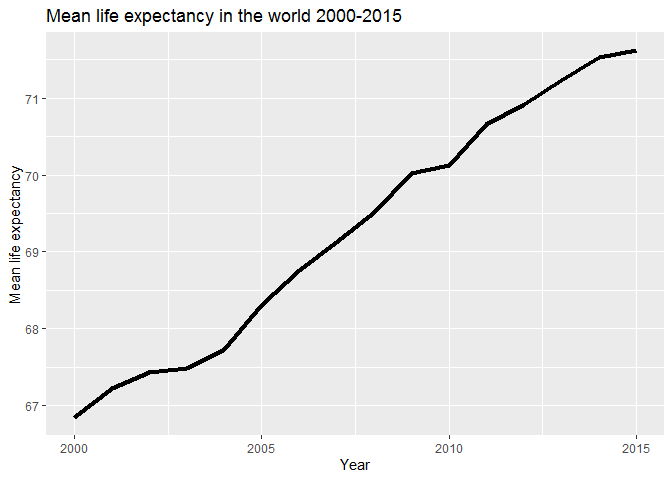
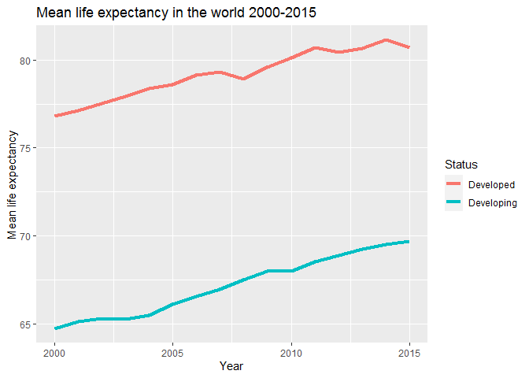
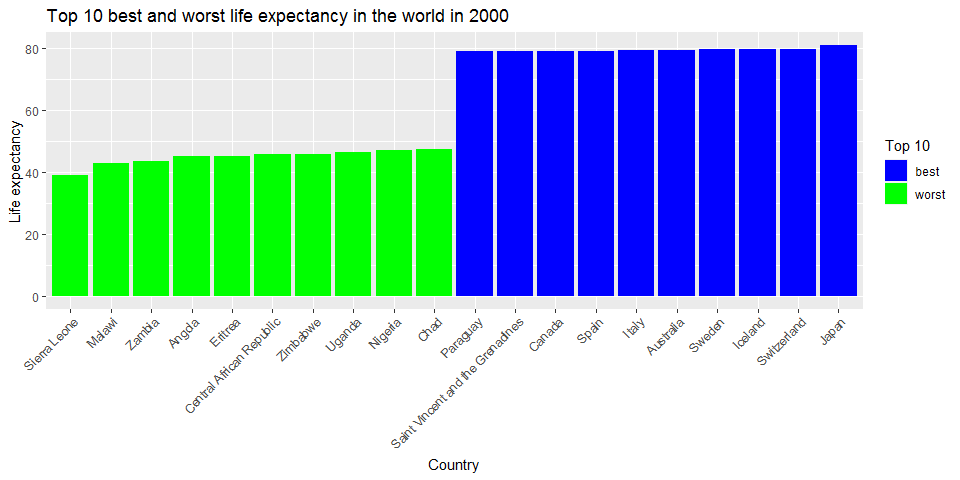
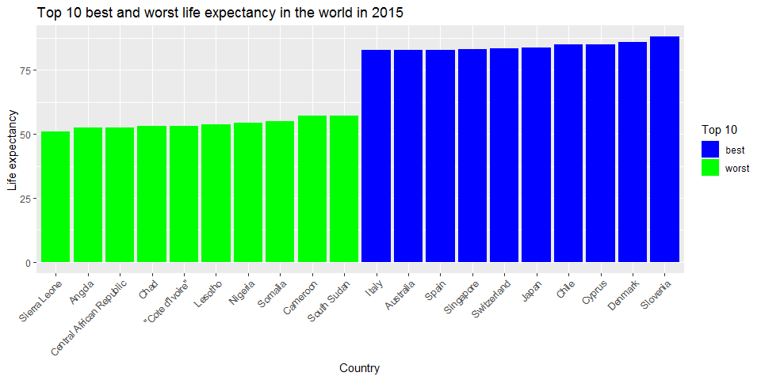

```r
Sys.Date()
```

```
## [1] "2020-12-18"
```

## Podsumowanie
Celem projektu byla analiza zbioru danych "Life expectancy" zawierajacego informacje o dlugosci zycia w poszczegolnych panstwach na przestrzeni kilku lat. Poczatkowym etapem analizy bylo ogolne zapoznanie sie ze zbiorem. Zapoznano sie ze statystykami oraz zauwazono problem braku wystarczajacej reprezentacji kilku panstw. Szczegolowa analiza doprowadzila do decyzji o usunieciu ich ze zbioru. Nastepnie podliczono wartosci brakujace dla kazdej kolumny, i zagregowano brakujace ilosci w wierszach do postaci sum NaNów, a nastepnie przeanalizowano najbardziej wybrakowane rekordy i atrybuty. Postanowiono rowniez przyjrzec sie kilku nastepnym wartosciom, ale w koncu podjeto decyzje o dokonaniu uzupelnienia wybrakowanych wartosci przez algorytm k-NN. Nastepnie dokonano szczegolowej analizy sytuacji przez wykreslenie wykresow pomagajacych rozeznac sie w zaleznosciach miedzy atrybutami. Sprawdzono ilosci kategorii, rozklady oraz korelacje miedzy atrybutami. Stworzono rowniez interaktywny wykres dlugosci zycia w czasie pozwalajacy na filtrowanie na podstawie panstwa. Ostatnim etapem bylo wytrenowanie modelu regresji liniowej do przewidywania dlugosci zycia. W tym miejscu dokonano rowniez analizy modelu.

## Operacje wstepne

Uzyte biblioteki

```r
library(readr)
library(dplyr)
library(knitr)
library(ggplot2)
library(tidyr)
library(stringr)
library(DMwR)
library(reshape2)
library(leaflet)
library(caret)
```

Zapewnienie powtarzalnosci wyników

```r
set.seed(101)
```

Wczytanie zbioru danych

```r
df <- read_csv("data/Life_Expectancy_Data.csv", quote = "")
```

```
## 
## -- Column specification ------------------------------------------------------------------------------------
## cols(
##   .default = col_double(),
##   Country = col_character(),
##   Status = col_character()
## )
## i Use `spec()` for the full column specifications.
```

## Zapoznanie sie ze zbiorem

Pierwszym etapem analizy jest zapoznanie sie z wymiarowoscia zbioru oraz jego struktura przez wypisanie kilku poczatkowych wierszy

```r
dim(df)
```

```
## [1] 2938   22
```


```r
kable(head(df), digits=2)
```


|Country     | Year|Status     | Life expectancy| Adult Mortality| infant deaths| Alcohol| percentage expenditure| Hepatitis B| Measles|  BMI|
|:-----------|----:|:----------|---------------:|---------------:|-------------:|-------:|----------------------:|-----------:|-------:|----:|
|Afghanistan | 2015|Developing |            65.0|             263|            62|    0.01|                  71.28|          65|    1154| 19.1|
|Afghanistan | 2014|Developing |            59.9|             271|            64|    0.01|                  73.52|          62|     492| 18.6|
|Afghanistan | 2013|Developing |            59.9|             268|            66|    0.01|                  73.22|          64|     430| 18.1|
|Afghanistan | 2012|Developing |            59.5|             272|            69|    0.01|                  78.18|          67|    2787| 17.6|
|Afghanistan | 2011|Developing |            59.2|             275|            71|    0.01|                   7.10|          68|    3013| 17.2|
|Afghanistan | 2010|Developing |            58.8|             279|            74|    0.01|                  79.68|          66|    1989| 16.7|


| under-five deaths| Polio| Total expenditure| Diphtheria| HIV/AIDS|    GDP| Population| thinness  1-19 years| thinness 5-9 years| Income composition of resources| Schooling|
|-----------------:|-----:|-----------------:|----------:|--------:|------:|----------:|--------------------:|------------------:|-------------------------------:|---------:|
|                83|     6|              8.16|         65|      0.1| 584.26|   33736494|                 17.2|               17.3|                            0.48|      10.1|
|                86|    58|              8.18|         62|      0.1| 612.70|     327582|                 17.5|               17.5|                            0.48|      10.0|
|                89|    62|              8.13|         64|      0.1| 631.74|   31731688|                 17.7|               17.7|                            0.47|       9.9|
|                93|    67|              8.52|         67|      0.1| 669.96|    3696958|                 17.9|               18.0|                            0.46|       9.8|
|                97|    68|              7.87|         68|      0.1|  63.54|    2978599|                 18.2|               18.2|                            0.45|       9.5|
|               102|    66|              9.20|         66|      0.1| 553.33|    2883167|                 18.4|               18.4|                            0.45|       9.2|

Zauwazono ze dane zawieraja 2938 rekordow opisanych przez 22 atrybutow. Zbior danych zaweira informacje o ogólnym stanie gospodarki oraz o badaniach medycznych dla danego kraju w danym roku.


```r
kable(sapply(df, n_distinct))
```


|                                |    x|
|:-------------------------------|----:|
|Country                         |  193|
|Year                            |   16|
|Status                          |    2|
|Life expectancy                 |  363|
|Adult Mortality                 |  426|
|infant deaths                   |  209|
|Alcohol                         | 1077|
|percentage expenditure          | 2328|
|Hepatitis B                     |   88|
|Measles                         |  958|
|BMI                             |  609|
|under-five deaths               |  252|
|Polio                           |   74|
|Total expenditure               |  819|
|Diphtheria                      |   82|
|HIV/AIDS                        |  200|
|GDP                             | 2491|
|Population                      | 2279|
|thinness  1-19 years            |  201|
|thinness 5-9 years              |  208|
|Income composition of resources |  626|
|Schooling                       |  174|

Powyższa tabela zawiera iloci unikalnych wartoci dla kazdej kolumny. Widac ze dane zostaly zebrane dla 193 panstw i zebrane zostaly na przestrzeni 16 lat.

Podstawowe statystyki dla każdej kolumny w zbiorze

```r
kable(summary(select(df, Country:Measles)))
```


|   |  Country        |     Year    |   Status        |Life expectancy |Adult Mortality |infant deaths  |   Alcohol      |percentage expenditure | Hepatitis B  |   Measles       |
|:--|:----------------|:------------|:----------------|:---------------|:---------------|:--------------|:---------------|:----------------------|:-------------|:----------------|
|   |Length:2938      |Min.   :2000 |Length:2938      |Min.   :36.30   |Min.   :  1.0   |Min.   :   0.0 |Min.   : 0.0100 |Min.   :    0.000      |Min.   : 1.00 |Min.   :     0.0 |
|   |Class :character |1st Qu.:2004 |Class :character |1st Qu.:63.10   |1st Qu.: 74.0   |1st Qu.:   0.0 |1st Qu.: 0.8775 |1st Qu.:    4.685      |1st Qu.:77.00 |1st Qu.:     0.0 |
|   |Mode  :character |Median :2008 |Mode  :character |Median :72.10   |Median :144.0   |Median :   3.0 |Median : 3.7550 |Median :   64.913      |Median :92.00 |Median :    17.0 |
|   |NA               |Mean   :2008 |NA               |Mean   :69.22   |Mean   :164.8   |Mean   :  30.3 |Mean   : 4.6029 |Mean   :  738.251      |Mean   :80.94 |Mean   :  2419.6 |
|   |NA               |3rd Qu.:2012 |NA               |3rd Qu.:75.70   |3rd Qu.:228.0   |3rd Qu.:  22.0 |3rd Qu.: 7.7025 |3rd Qu.:  441.534      |3rd Qu.:97.00 |3rd Qu.:   360.2 |
|   |NA               |Max.   :2015 |NA               |Max.   :89.00   |Max.   :723.0   |Max.   :1800.0 |Max.   :17.8700 |Max.   :19479.912      |Max.   :99.00 |Max.   :212183.0 |
|   |NA               |NA           |NA               |NA's   :10      |NA's   :10      |NA             |NA's   :194     |NA                     |NA's   :553   |NA               |

```r
kable(summary(select(df, BMI:`thinness 5-9 years`)))
```


|   |     BMI      |under-five deaths |    Polio     |Total expenditure |  Diphtheria  |   HIV/AIDS    |     GDP          |  Population      |thinness  1-19 years |thinness 5-9 years |
|:--|:-------------|:-----------------|:-------------|:-----------------|:-------------|:--------------|:-----------------|:-----------------|:--------------------|:------------------|
|   |Min.   : 1.00 |Min.   :   0.00   |Min.   : 3.00 |Min.   : 0.370    |Min.   : 2.00 |Min.   : 0.100 |Min.   :     1.68 |Min.   :3.400e+01 |Min.   : 0.10        |Min.   : 0.10      |
|   |1st Qu.:19.30 |1st Qu.:   0.00   |1st Qu.:78.00 |1st Qu.: 4.260    |1st Qu.:78.00 |1st Qu.: 0.100 |1st Qu.:   463.94 |1st Qu.:1.958e+05 |1st Qu.: 1.60        |1st Qu.: 1.50      |
|   |Median :43.50 |Median :   4.00   |Median :93.00 |Median : 5.755    |Median :93.00 |Median : 0.100 |Median :  1766.95 |Median :1.387e+06 |Median : 3.30        |Median : 3.30      |
|   |Mean   :38.32 |Mean   :  42.04   |Mean   :82.55 |Mean   : 5.938    |Mean   :82.32 |Mean   : 1.742 |Mean   :  7483.16 |Mean   :1.275e+07 |Mean   : 4.84        |Mean   : 4.87      |
|   |3rd Qu.:56.20 |3rd Qu.:  28.00   |3rd Qu.:97.00 |3rd Qu.: 7.492    |3rd Qu.:97.00 |3rd Qu.: 0.800 |3rd Qu.:  5910.81 |3rd Qu.:7.420e+06 |3rd Qu.: 7.20        |3rd Qu.: 7.20      |
|   |Max.   :87.30 |Max.   :2500.00   |Max.   :99.00 |Max.   :17.600    |Max.   :99.00 |Max.   :50.600 |Max.   :119172.74 |Max.   :1.294e+09 |Max.   :27.70        |Max.   :28.60      |
|   |NA's   :34    |NA                |NA's   :19    |NA's   :226       |NA's   :19    |NA             |NA's   :448       |NA's   :652       |NA's   :34           |NA's   :34         |

```r
kable(summary(select(df, `Income composition of resources`:Schooling)))
```


|   |Income composition of resources |  Schooling   |
|:--|:-------------------------------|:-------------|
|   |Min.   :0.0000                  |Min.   : 0.00 |
|   |1st Qu.:0.4930                  |1st Qu.:10.10 |
|   |Median :0.6770                  |Median :12.30 |
|   |Mean   :0.6276                  |Mean   :11.99 |
|   |3rd Qu.:0.7790                  |3rd Qu.:14.30 |
|   |Max.   :0.9480                  |Max.   :20.70 |
|   |NA's   :167                     |NA's   :163   |

W zbiorze znajduja sie 2 kolumny kateogryczne - Country oraz Status, a pozostae kolumny zawieraj dane numeryczne. Statystyki pokazuja ze dane sa w duzej mierze nieustandaryzowane, a wartosci min i max dla kolumn takich jak np. 'percentage expenditure', GDP czy BMI wskazuja takze na wystepowanie outlierow.

Zauwazono rowniez ze 193 kraje * 16 obserwacji (kazdy rok) = 3088, a laczna liczba obserwacji = 2938. Postanowiono wiec sprawdzic liczebnosc obserwacji dla kazdego roku:


```r
df %>% group_by(Year) %>% summarise(count = n()) %>% kable
```

```
## `summarise()` ungrouping output (override with `.groups` argument)
```


| Year| count|
|----:|-----:|
| 2000|   183|
| 2001|   183|
| 2002|   183|
| 2003|   183|
| 2004|   183|
| 2005|   183|
| 2006|   183|
| 2007|   183|
| 2008|   183|
| 2009|   183|
| 2010|   183|
| 2011|   183|
| 2012|   183|
| 2013|   193|
| 2014|   183|
| 2015|   183|

Wyglada na to ze 183 panstwa sa w pelni reprezentowane na przestrzeni lat 2000 - 2016, a w 2013 znalazlo sie 10 dodatkowych. Sprawdzono wiec co to za panstwa:


```r
df %>% 
  group_by(Country) %>% 
  summarise(count = n(), gdp = GDP, population = Population, life_expectancy = `Life expectancy`) %>% 
  filter(count == 1) %>% 
  kable
```

```
## `summarise()` regrouping output by 'Country' (override with `.groups` argument)
```


|Country               | count|       gdp| population| life_expectancy|
|:---------------------|-----:|---------:|----------:|---------------:|
|Cook Islands          |     1|        NA|         NA|              NA|
|Dominica              |     1|  722.7567|         NA|              NA|
|Marshall Islands      |     1| 3617.7524|         NA|              NA|
|Monaco                |     1|        NA|         NA|              NA|
|Nauru                 |     1|  136.1832|         NA|              NA|
|Niue                  |     1|        NA|         NA|              NA|
|Palau                 |     1| 1932.1224|        292|              NA|
|Saint Kitts and Nevis |     1|        NA|         NA|              NA|
|San Marino            |     1|        NA|         NA|              NA|
|Tuvalu                |     1| 3542.1359|       1819|              NA|

Patrzac na otrzymany wynik oraz bazujac na wiedzy geograficznej mozna stwierdzic, ze sa to stosunkowo niewielkei kraje. Ciekawe jest rowniez to, ze nie posiadamy dla nich informacji o zmiennej przewidywanej - Life expectancy. Sprawdzono przy tym ilosc rekordow z brakujaca wartoscia dla Life expectancy: 


```r
df %>% filter(is.na(`Life expectancy`)) %>% nrow()
```

```
## [1] 10
```

Widac, ze ilosc rekordow sie pokrywa - wszystkie rekordy z brakujaca wartoscia Life expectancy naleza do panstw, reprezentowanych pojedynczo w roku 2013.

## Czyszczenie danych

Count % of missing values for every column

```r
missing_df <- df %>% 
  summarise_all(list(~sum(is.na(.))/length(.))) %>%
  gather(key="column", value="missing") %>%
  filter(missing > 0) %>%
  ggplot(aes(x=reorder(column, missing), y=missing)) +
  geom_bar(stat="identity") +
  coord_flip()

missing_df
```

<!-- -->

Powyzszy wykres pokazuje procent brakujacych przypadkow w kolumnach. Widac, ze najbardziej wybrakowana cecha jest Population, w ktorej brakujace wartosci stanowia ponad 20% wszystkich wartosci w kolumnie.

Postanowiono lepiej przyjrzec sie brakujacym wartosciom w zbiorze. W pierwszej kolejnosci podsumowano iloci brakujacych danych w wierszach i wypisano je wraz z ich liczebnoscia

```r
na_count <- apply(df, 1, function(x) sum(is.na(x)))
idx <- 1:nrow(df)
id_na_count <- as.data.frame(cbind(idx, na_count))

counts <- id_na_count %>%
  group_by(na_count) %>%
  summarize(amount = n()) %>%
  arrange(desc(na_count))
```

```
## `summarise()` ungrouping output (override with `.groups` argument)
```

```r
kable(counts)
```


| na_count| amount|
|--------:|------:|
|        9|      9|
|        8|      4|
|        6|     28|
|        5|     45|
|        4|    122|
|        3|     64|
|        2|    360|
|        1|    657|
|        0|   1649|

Wychodzi na to, ze jest 13 przypadkow wybrakowanych w ponad 30%. Zdecydowano sie wiec na ten punkt odciecia i sprawdzono w jakich panstwach i latach wystepowaly te przypadki


```r
row_select <- id_na_count %>%
  filter(na_count >= 8) %>%
  select(idx)

df[unlist(row_select),] %>% select(Country, Year) %>% kable
```


|Country     | Year|
|:-----------|----:|
|Monaco      | 2013|
|San Marino  | 2013|
|South Sudan | 2010|
|South Sudan | 2009|
|South Sudan | 2008|
|South Sudan | 2007|
|South Sudan | 2006|
|South Sudan | 2005|
|South Sudan | 2004|
|South Sudan | 2003|
|South Sudan | 2002|
|South Sudan | 2001|
|South Sudan | 2000|

Lacznie sa to trzy panstwa, z czego dane dla South Sudan sa mocno wybrakowane na przestrzeni lat 2000-2010. Ma to sens, gdyz panstwo to formalnie powstalo dopiero w 2011 roku. Pozostale wartosci - Monaco oraz San Marino, odnosza sie do wyzej wymienionych panstw majacych jedynie jeden rekord danych dla roku 2013.

Ze wzgledu na to ze Population jest najbardziej wybrakowanym atrybutem, postanowiono takze blizej go przeanalizowac. Wypisano wiec kraje w ktorych atrybut ten nie zostal ani razu uzupelniony.


```r
by_country_population <- df %>%
  group_by(Country) %>%
  summarise(
    count = n(),
    na = sum(is.na(Population))
  ) %>%
  filter(count == na) %>%
  select(Country)
```

```
## `summarise()` ungrouping output (override with `.groups` argument)
```

```r
kable(pull(by_country_population, Country))
```


|x                                                    |
|:----------------------------------------------------|
|"Cote d'Ivoire"                                      |
|"Democratic People's Republic of Korea"              |
|Antigua and Barbuda                                  |
|Bahamas                                              |
|Bahrain                                              |
|Barbados                                             |
|Bolivia (Plurinational State of)                     |
|Brunei Darussalam                                    |
|Congo                                                |
|Cook Islands                                         |
|Cuba                                                 |
|Czechia                                              |
|Democratic Republic of the Congo                     |
|Dominica                                             |
|Egypt                                                |
|Gambia                                               |
|Grenada                                              |
|Iran (Islamic Republic of)                           |
|Kuwait                                               |
|Kyrgyzstan                                           |
|Lao People's Democratic Republic                     |
|Libya                                                |
|Marshall Islands                                     |
|Micronesia (Federated States of)                     |
|Monaco                                               |
|Nauru                                                |
|New Zealand                                          |
|Niue                                                 |
|Oman                                                 |
|Qatar                                                |
|Republic of Korea                                    |
|Republic of Moldova                                  |
|Saint Kitts and Nevis                                |
|Saint Lucia                                          |
|Saint Vincent and the Grenadines                     |
|San Marino                                           |
|Saudi Arabia                                         |
|Singapore                                            |
|Slovakia                                             |
|Somalia                                              |
|The former Yugoslav republic of Macedonia            |
|United Arab Emirates                                 |
|United Kingdom of Great Britain and Northern Ireland |
|United Republic of Tanzania                          |
|United States of America                             |
|Venezuela (Bolivarian Republic of)                   |
|Viet Nam                                             |
|Yemen                                                |

```r
country_pop <- df %>%
  group_by(Country) %>%
  summarise(
    mean_pop = mean(Population),
    median_pop = median(Population),
    std_pop = sd(Population),
    min_pop = min(Population),
    max_pop = max(Population),
    na = sum(is.na(Population))
  ) %>%
  filter(na == 0)
```

```
## `summarise()` ungrouping output (override with `.groups` argument)
```

```r
kable(sample_n(country_pop, 20))
```


|Country             |    mean_pop|  median_pop|     std_pop| min_pop|    max_pop| na|
|:-------------------|-----------:|-----------:|-----------:|-------:|----------:|--:|
|Costa Rica          |   2309299.4|   2206647.5|   2092412.7|   46324|    4757575|  0|
|Azerbaijan          |   2157370.5|    843820.0|   3566281.5|    8365|    9649341|  0|
|Nigeria             |  70877003.1|  16735354.5|  72003797.9| 1223529|  181181744|  0|
|Palau               |       292.0|       292.0|          NA|     292|        292|  0|
|Pakistan            |  69027961.8|  16348718.5|  79541925.8|   15783|  185546257|  0|
|Indonesia           | 116555259.4|  24904887.0| 115186206.6| 2145652|  258162113|  0|
|Niger               |  11240718.9|  14143393.5|   7407838.5|   12262|   19896965|  0|
|India               | 421467690.9| 125544740.5| 532788375.4| 1395398| 1293859294|  0|
|Benin               |   3942978.9|   1431332.0|   3844086.6|    7754|    9199259|  0|
|Norway              |   2614432.3|   2546687.0|   2193111.2|  449967|    5137232|  0|
|France              |  27581733.1|   6631162.5|  28934588.1|  647744|   66331957|  0|
|Solomon Islands     |    329044.2|    441015.5|    226998.8|   41269|     587482|  0|
|Ethiopia            |  43950760.8|  38262332.0|  40869235.8|    8149|   97366774|  0|
|Myanmar             |  26015702.0|  26307254.0|  24043901.8|   49869|   51924182|  0|
|Fiji                |    650205.1|    817491.0|    337079.5|   84334|     892149|  0|
|Iraq                |  18572840.8|  24595474.0|  14055443.2|    3568|   36115649|  0|
|Trinidad and Tobago |    776133.1|   1272910.5|    635774.6|   13281|    1354493|  0|
|Iceland             |    186177.6|    286245.5|    141294.7|   28125|     327386|  0|
|Mexico              |  27585265.2|  11460708.5|  44950945.4|  119917|  122535969|  0|
|Mauritius           |    663332.9|    656903.5|    588208.1|    1254|    1258653|  0|

Lista jest dluga i znajduja sie na niej najrozniejsze panstwa, teoretycznie, bazujac na wiedzy geograficznej, nie majace ze soba zbyt wiele wspolnego.

Powyzsza analiza doprowadzila do podjecia dezycji o usunieciu rekordow z brakujaca wartoscia dla atrybutu przewidywanego - Life expectancy, rekordow majacych najwieksza ilosc wybrakowanych wartosci, oraz atrybutu Population, ktory jest najbardziej wybrakowanym atrybutem, a takze, w teorii, zawierajacym informacje juz reprezentowane w zbiorze w postaci atrybutu GDP, czyli PKB per capita.


```r
df <- df[-unlist(row_select),]
df <- filter(df, !is.na(`Life expectancy`))
df <- select(df, -Population)

dim(df)
```

```
## [1] 2917   21
```

Zbior po usunieciu wybranych wartosci ma wiec wymiary wypisane powyzej. Po raz kolejny zdecydowano sie wiec wyrysowac wykres prezentujacy procentowa wartosc wybrakowania atrybutow:


```r
missing_df <- df %>% 
  summarise_all(list(~sum(is.na(.))/length(.))) %>%
  gather(key="column", value="missing") %>%
  filter(missing > 0) %>%
  ggplot(aes(x=reorder(column, missing), y=missing)) +
  geom_bar(stat="identity") +
  coord_flip()

missing_df
```

<!-- -->

Z wykresu zniknely 3 kolumny. Postanowiono znowu doglebniej przyjrzec sie kilku przypadkom. Najrzadziej wybrakowanym sa atrybuty Polio oraz Diphtheria, prezentujace procent dzieci 1 rocznych zaszczepionych na dane choroby. Sprawdzono wiec co dla jakich panstw oraz w jakich latach zostalo to nieuzupelnione:


```r
diphtheria_polio <- df %>%
  filter(is.na(Diphtheria) | is.na(Polio)) %>%
  select(Country, Year, GDP, `Life expectancy`)
kable(diphtheria_polio)
```


|Country     | Year|        GDP| Life expectancy|
|:-----------|----:|----------:|---------------:|
|Montenegro  | 2005| 3674.61792|            73.6|
|Montenegro  | 2004|  338.19954|            73.5|
|Montenegro  | 2003| 2789.17350|            73.5|
|Montenegro  | 2002|  216.24327|            73.4|
|Montenegro  | 2001|  199.58396|            73.3|
|Montenegro  | 2000| 1627.42893|            73.0|
|Timor-Leste | 2001|   56.42499|            59.4|
|Timor-Leste | 2000|  422.28633|            58.7|

Rowniez sa to ciekawe przypadki, gdyz znowu wartosci sa wybrakowane dla panstw ktore nie istnialy w danych latach. Czarnogora powstala w 2006, oraz Timor Wschodni w 2002. Co ciekawe od tych momentow te atrybuty dla tych panstw sa juz uzupelnione.

Pozostale wartosci wybrakowane postanowiono uzupelnic uzywajac do tego algorytmu knn, co jest dosc standardowa i stosunkowo trafna technika imputacji wartosci. 


```r
df_to_impute <- as.data.frame(df)
df_to_impute$Country <- as.factor(df$Country)
df_to_impute$Status <- as.factor(df$Status)

df_clean <- knnImputation(df_to_impute)
```

## Szczegolowa analiza 

Majac juz wyczyszczony zbior danych, postanowiono rowniez sprawdzic stosunek ilosci panstw rozwinietych i rozwijajacych sie. Wyniki zaprezentowano na wykresie:


```
## `summarise()` ungrouping output (override with `.groups` argument)
```

<!-- -->

## Prezentacja rozkładów wartości


```
## No id variables; using all as measure variables
```

<!-- -->

Powyższy wykres pokazuje rozklady wartosci poszczegolnych atrybutów. Patrzac na nie mozna wyszczegolnic grupe atrybutow o rozkladzie bliskim rozkladowi Pareto lub wrecz rozkladzie eksponencjalnym, do ktorej naleza np. GDP, Measles, czy Infant deaths. Generalnie widac prawidlowosci, ktore sa rowniez intuicyjne, np. skupianie sie wskaznikow smierci wokol niskich wartosci, lub procentowych wskaznikow szczepien wokol wyzszych.


```r
df_clean %>% filter(`infant deaths` > 1000 | `under-five deaths` > 1000) %>%
  select(Country, Year, `infant deaths`, `under-five deaths`) %>%
  kable
```


|Country | Year| infant deaths| under-five deaths|
|:-------|----:|-------------:|-----------------:|
|India   | 2015|           910|              1100|
|India   | 2014|           957|              1200|
|India   | 2013|          1000|              1300|
|India   | 2012|          1100|              1400|
|India   | 2011|          1100|              1500|
|India   | 2010|          1200|              1600|
|India   | 2009|          1300|              1700|
|India   | 2008|          1300|              1800|
|India   | 2007|          1400|              1900|
|India   | 2006|          1500|              2000|
|India   | 2005|          1500|              2000|
|India   | 2004|          1600|              2100|
|India   | 2003|          1700|              2200|
|India   | 2002|          1700|              2300|
|India   | 2001|          1800|              2400|
|India   | 2000|          1800|              2500|

## Korelacja

<!-- -->

Wykres korelacji pokazuje kilka ciekawych zaleznosci. Najwyzszy wspolczynnik korelacji = 1 osiagnieto dla pary atrybutów infant deaths, under-five deaths, co jest calkiem logiczne. Wychodzi na to ze sa to atrybuty w pelni skorelowane, zawieraja wiec praktycznie te sama informacje. Analogiczna sytuacja zachodzi dla atrybutów thinness. Kolejna wysoka korelacja wyszla dla pary GDP, percentage expenditure, co jest dosc ciekawe zwazywszy na fakt, ze juz korelacja w stosunku do Total expenditure jest dosc niska = 0.17. Mozna domyslac sie iż prawdopodobnie oznacza to ze wydatki rosna calosciowo w stosunku do pkb, co nie zmienialoby znaczaco procentowego udzialu wydatkow na ochrone zdrowia.

Analizujac czesc wykresu pokazujaca wyniki dla atrybutu przewidywanego, widac, ze ma on wysoka korelacje z atrybutami Schooling oraz Income composition of resources (rowniez wysoka wspolna korelacja). Wysoka ujemna korelacja wystepuje dla atrybutu Adult mortality, co jest calkiem logiczne.

Postanowiono rowniez przyjrzec sie jak poszczegolne przypadki wygladaja w praktyce w podziale na kraje rozwiniete i rozwijajace sie. Wykreslono wiec wykresy punktowe dla zmiennych niezaleznych wzgledem zmiennej przewidywanej.

<!-- -->

## Srednia wartosc dlugosci zycia na swiecie


```
## `summarise()` ungrouping output (override with `.groups` argument)
```

<!-- -->

Wykres pokazuje ze wartosc sredniej dlugosci zycia na swiecie rosnie. Postanowiono przyjrzec sie jak to wyglada w podziale na panstwa rozwiniete i rozwijajace sie


```
## `summarise()` regrouping output by 'Status' (override with `.groups` argument)
```

<!-- -->

Rowniez tutaj widac, ze ogolny trend dla obu kategorii jest raczej wzrostowy. Jednak dla panstw rozwijajacych sie jest on niemalze liniowy. Mimo to widac znaczaca roznice miedzy tymi kategoriami, przekraczajaca ponad 10 lat.


```
## `summarise()` ungrouping output (override with `.groups` argument)
```

<!-- -->


```
## `summarise()` ungrouping output (override with `.groups` argument)
```

<!-- -->


## Regresor

Wpierw należy przygotowac dane. Zamieniono wiec atrybut Status na binarny atrybut Developed. Oprócz tego postanowiono zmniejszyc wymiarowosc zbioru przez wyrzucenie kolumn wysoko skorelowanych z jakas inna kolumna (nie przewidywana). Kolumny ktore wyrzucono to: infant deaths, percentage expenditure oraz thinness 5-9. Postanowiono również wyrzucic kolumne Country, ponieważ jest ona dosc problematyczna w odpowiednim przetworzeniu - labelowanie wprowadzaloby pewna relacje miedzy panstwami, skorelowana z kolejnoscia liter w alfabecie, a one hot encoding spowodowalby znaczne rozrosniecie sie wymiarowosci zbioru.


```r
df_clean$Developed <- sapply(df_clean$Status == "Developed", as.numeric)

df_complete <- select(df_clean, -c(Status, Country, `infant deaths`, 
                                `percentage expenditure`, `thinness 5-9 years`))
```

Podzielono dane na zbiory treningowy oraz testowy w stosunku 70% - 30%


```r
idx <- createDataPartition(df_complete$`Life expectancy`, p=0.7, list=F)
train <- df_complete[idx,]
test <- df_complete[-idx,]
```

Ze wzgledu na rozne skale wartosci kolumn postanowiono przeprowadzic standaryzacje zbioru i przeskalowanie kolumn do wartosci z przedzialu [0, 1]


```r
preProcValues <- preProcess(train, method = "range")

train<- predict(preProcValues, train)
test <- predict(preProcValues, test)
```

Nastepnie wyuczono model regresji liniowej


```r
linearModel = lm(`Life expectancy` ~ ., data=train)
summary(linearModel)
```

```
## 
## Call:
## lm(formula = `Life expectancy` ~ ., data = train)
## 
## Residuals:
##      Min       1Q   Median       3Q      Max 
## -0.39282 -0.04224 -0.00215  0.04302  0.35092 
## 
## Coefficients:
##                                    Estimate Std. Error t value Pr(>|t|)    
## (Intercept)                        0.320141   0.012384  25.852  < 2e-16 ***
## Year                              -0.011211   0.005941  -1.887  0.05929 .  
## `Adult Mortality`                 -0.272340   0.013343 -20.410  < 2e-16 ***
## Alcohol                           -0.002022   0.010572  -0.191  0.84833    
## `Hepatitis B`                     -0.021331   0.009572  -2.228  0.02596 *  
## Measles                           -0.115318   0.033641  -3.428  0.00062 ***
## BMI                                0.049603   0.008646   5.737 1.11e-08 ***
## `under-five deaths`               -0.074687   0.031786  -2.350  0.01888 *  
## Polio                              0.052957   0.009609   5.511 4.02e-08 ***
## `Total expenditure`                0.021912   0.013361   1.640  0.10115    
## Diphtheria                         0.076434   0.010755   7.107 1.64e-12 ***
## `HIV/AIDS`                        -0.463498   0.021822 -21.240  < 2e-16 ***
## GDP                                0.106556   0.017541   6.075 1.48e-09 ***
## `thinness  1-19 years`            -0.020644   0.014315  -1.442  0.14942    
## `Income composition of resources`  0.142231   0.013513  10.525  < 2e-16 ***
## Schooling                          0.289024   0.020276  14.255  < 2e-16 ***
## Developed                          0.018519   0.006235   2.970  0.00301 ** 
## ---
## Signif. codes:  0 '***' 0.001 '**' 0.01 '*' 0.05 '.' 0.1 ' ' 1
## 
## Residual standard error: 0.07619 on 2027 degrees of freedom
## Multiple R-squared:  0.8218,	Adjusted R-squared:  0.8204 
## F-statistic: 584.2 on 16 and 2027 DF,  p-value: < 2.2e-16
```

Wynik polecenia summary dla wytrenowanego modelu prezentuje kilka waznych statystyk. W celu interpretacji znaczenia poszczególnych atrybutów w modelu najwazniejsze sa prawdopodobnie p-values. Niskie wartosci p-value oznaczaja odrzucenie hipotezy zerowej o mnozniku danego atrybutu rownego 0. Mozna wiec zauwazyc ze prawdopodobnie najmniej istotnymi atrybutami w uzyskanym modelu sa atrybuty Alcohol, thinness  1-19 years oraz Total expenditure. W przypadku standardowego progu p-value < 0.05, mozna stwierdzic, ze rowniez atrybut Year nie odgrywa znaczacej roli.


```r
train <- select(train, -c(Alcohol, Year, `thinness  1-19 years`, `Total expenditure`))
test <- select(test, -c(Alcohol, Year, `thinness  1-19 years`, `Total expenditure`))

linearModel = lm(`Life expectancy` ~ ., data=train)
summary(linearModel)
```

```
## 
## Call:
## lm(formula = `Life expectancy` ~ ., data = train)
## 
## Residuals:
##      Min       1Q   Median       3Q      Max 
## -0.38474 -0.04279 -0.00250  0.04430  0.35365 
## 
## Coefficients:
##                                    Estimate Std. Error t value Pr(>|t|)    
## (Intercept)                        0.316824   0.011026  28.734  < 2e-16 ***
## `Adult Mortality`                 -0.274213   0.013262 -20.677  < 2e-16 ***
## `Hepatitis B`                     -0.024308   0.009512  -2.555 0.010680 *  
## Measles                           -0.110806   0.033499  -3.308 0.000957 ***
## BMI                                0.055534   0.008161   6.805 1.33e-11 ***
## `under-five deaths`               -0.098003   0.029195  -3.357 0.000803 ***
## Polio                              0.053072   0.009608   5.524 3.75e-08 ***
## Diphtheria                         0.078529   0.010724   7.323 3.48e-13 ***
## `HIV/AIDS`                        -0.458983   0.021557 -21.291  < 2e-16 ***
## GDP                                0.103522   0.017510   5.912 3.95e-09 ***
## `Income composition of resources`  0.137406   0.013295  10.335  < 2e-16 ***
## Schooling                          0.291586   0.019551  14.914  < 2e-16 ***
## Developed                          0.023031   0.005567   4.137 3.67e-05 ***
## ---
## Signif. codes:  0 '***' 0.001 '**' 0.01 '*' 0.05 '.' 0.1 ' ' 1
## 
## Residual standard error: 0.07628 on 2031 degrees of freedom
## Multiple R-squared:  0.821,	Adjusted R-squared:   0.82 
## F-statistic: 776.4 on 12 and 2031 DF,  p-value: < 2.2e-16
```


Wyniki modelu na zbiorze treningowym zaprezentowano ponizej:


```r
pred1 <- predict(linearModel, newdata = test)
rmse <- sqrt(sum((exp(pred1) - test$`Life expectancy`)^2)/length(test$`Life expectancy`))
c(RMSE = rmse, R2=summary(linearModel)$r.squared)
```

```
##      RMSE        R2 
## 1.2780673 0.8210253
```

Jak widac model osiagnal calkiem przyzwoity wynik. Wynik R^2 mozna zinterpretowac jako 82% calkowitej wariancji w dlugosci zycia mozliwej do wytlumaczenia przez uzyte atrybuty, co wydaje sie byc calkiem solidnym wynikiem.
